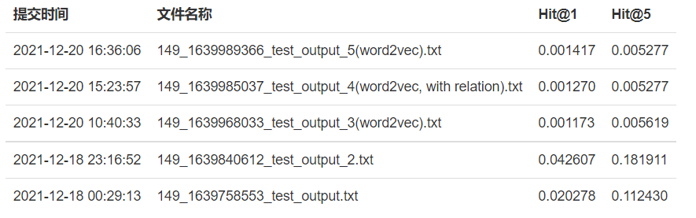

# 实验二 报告

PB19000046 曹奕阳

## 概述

本实验要求在给定的带有文本描述的知识图谱数据集上，设计一种知识图谱补全算
法，在给定的测试集上预测出缺失的三元组的尾实体。本组选择了TransE、word2vec两种方法完成任务，其中TransE方法参考代码 https://github.com/Cpaulyz/BigDataAnalysis/tree/master/Assignment8 ，word2vec方法为原创性的简单尝试。

## 算法流程和实现方法

1、TransE：

TransE将起始实体，关系，指向实体映射成同一空间的向量，如果(head,relation,tail)存在 (下文记为$(h,r,t)$ )，那么$h+r≈t$. 算法的核心步骤如下图所示。

训练过程包括初始化、选取batch、梯度下降更新。首先根据维度，为每个实体和关系初始化向量并归一化。然后设置`batch_size`数目，每次从训练集中随机选择`batch_size`个三元组，并随机构成一个错误的三元组$S'$进行更新。在梯度下降过程中，需要定义距离$d(x,y)$表示两个向量之间的距离（一般情况下取L1或L2 normal），使得对于正确的三元组$(h,r,t)$,距离$d(h+r,t)$越小越好；对于错误的三元组$(h',r,t')$,距离$d(h'+r,t')$越小越好。

通过transE建模后，我们得到了每个实体和关系的嵌入向量，利用嵌入向量，我们可以进行知识图谱的链接预测。对于尾实体$(h,r,?)$的预测，假设$t'=h+r$，则在所有的实体中选择与$t'$距离最近的向量，即为$t$的预测值。

在具体的实现过程中，与参考的代码不同的地方主要有以下几点：
* 三元组下标的对应关系。
* 统计实体集和关系集时包括了在描述文件中出现的实体和关系，以减少特殊情况的处理。
* 测试集中头实体不在实体集中，则进行特殊处理。
* 对于数据集的验证、测试及文件的读写，充分复用代码，用指示变量加以区分。
* 考虑到总数据量较大，模型训练轮次增大到2000.

2、word2vec：

word2vec可以根据给定的语料库，通过优化后的训练模型快速有效地将一个词语表达成向量形式，为自然语言处理领域的应用研究提供了新的工具。word2vec依赖skip-grams或连续词袋（CBOW）来建立神经词嵌入。

本实验中尝试对实体和关系的描述建立word2vec模型。对每个测试集中的（头实体，关系），寻找尾实体，利用三者的向量表示计算特定指标，排序输出前5个尾实体。

## 实验结果与分析

所有提交记录如下图，最佳结果见`submit/best_result.txt`。

从下到上，前两次提交使用TransE方法，分别在距离度量为L1和L2的情况下训练模型，其他参数相同。测试效果L2要显著优于L1，说明用二维特征刻画实体或关系向量更符合现实情况。

后三次提交仅使用word2vec方法，并基于实体和关系的向量表示计算距离，并排序输出结果。测试结果并不理想，主要原因是没有使用训练集中的三元组，丢失了大量关系信息。

可以考虑的改进方向如改进评价指标，使得指标能更好地反映实体间的联系。或者引入图结构（利用训练集的三元组），将实体抽象成顶点，将关系抽象成有向边。对测试集中的（头实体$h$，关系$r$），可以寻找$h$的出边上与$r$最相似的关系$r'$继续向外拓展。这种方法可能导致计算规模偏大，影响测试效率，但能充分利用提供的信息，达到较高的准确率。
