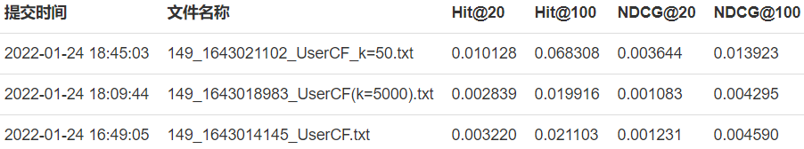

<center>
<font size=6>实验3-推荐系统和社会网络 实验报告</font>

PB19000046 曹奕阳
</center>

### 概述

本实验的主要任务是根据豆瓣数据集，结合课程中推荐系统 (第14节) 、社会网络 (第15节) 的内容，查阅相关资料，合理设计模型，为每个用户提供音乐方面的个性化推荐，生成Top-N列表（这里N=100）。

我实现了基于用户的协同过滤方法，代码模板参考 https://github.com/mercurialgh/collaborative-filtering ，对核心函数按照课件中给出的公式进行了重写。

### 统计分析与预处理

我写了一个简单的程序（`src/UserCF/Preprocessing.py`）统计音乐数据集`DoubanMusic.txt`中出现的物品（音乐）数。用户数可以通过观察数据集直接求得：由于用户的序号按自然数顺序排列，可知用户的编号为0到23598。基于每个物品都有至少10条交互记录的假设，可知物品的编号连续出现，故按编号从小到大找到第一个不存在的编号即可。物品的编号范围为0到21601。

输入数据按格式分解成 用户编号 和 交互的物品、评分组成的字典（所有元素均转换为整数类型），并在读入完成后预先计算每个用户的平均评分和相似度公式中分母的被除项。用户的相似度公式如下，其中分母的每个乘积项仅与单个用户的交互情况相关，故可进行预处理。
$$sim(a,b)=\frac{\sum_{p\in product(P)}(r_{a,p}-\overline{r}_a)(r_{b,p}-\overline{r}_b)}{\sqrt {\sum_{p\in product(P)}(r_{a,p}-\overline{r}_a)^2}\sqrt {\sum_{p\in product(P)}(r_{b,p}-\overline{r}_b)^2}}$$

### 算法流程

1、**数据预处理**：见上一小节的内容。
2、**计算用户相似度**：代码如下所示，与计算相似度的公式相对应。需要注意的是，在实际测试中，若将所有用户的交互信息两两比较来计算相似度，程序会抛出`MemoryError`，原因是计算机的内存不足以存储这样大的一张表格。观察到抛出异常时已处理了15000多个用户，估计表格的总规模不会超过上限的两倍。因此，实现过程中将所有用户分为两组，对每组中的用户两两计算相似度。当然，节省空间的代价是影响预测的正确率，如某个用户和另一组中的某个用户有较大的相似度，这样的信息无法被获取到，进而影响后续推荐中的用户分布。

```python
usercnt = 0
for user1 in range(12000):  # MemoryError without limits on user1 & user2
    self.usersim.setdefault(user1,{})
    for user2 in range(12000):
        if (user1 == user2): continue
        dot = 0  
        for item in self.train[user1]: 
            if item in self.train[user2]:
                dot += (self.train[user1][item] - self.aver_rate[user1]) * (self.train[user2][item] - self.aver_rate[user2]) 
        self.usersim[user1].setdefault(user2,0)
        if self.div[user1] != 0 and self.div[user2] != 0:   # else usersim[user1][user2] = 0
            self.usersim[user1][user2] = dot / (self.div[user1] * self.div[user2])
    # print the progress
    usercnt += 1
    if usercnt % 1000 == 0:
        print(usercnt)

for user1 in range(12000, 23599):
    self.usersim.setdefault(user1,{})
    for user2 in range(12000, 23599):
        if (user1 == user2): continue
        dot = 0  
        for item in self.train[user1]: 
            if item in self.train[user2]:
                dot += (self.train[user1][item] - self.aver_rate[user1]) * (self.train[user2][item] - self.aver_rate[user2]) 
        self.usersim[user1].setdefault(user2,0)
        if self.div[user1] != 0 and self.div[user2] != 0:   # else usersim[user1][user2] = 0
            self.usersim[user1][user2] = dot / (self.div[user1] * self.div[user2])
    # print the progress
    usercnt += 1
    if usercnt % 1000 == 0:
        print(usercnt)
```

3、**生成推荐物品**：由于用户编号连续，`solv`函数中通过循环生成用户编号，并作为参数传到`recommend`函数中。该函数会返回预测评分最高的100个物品编号及对应的预测评分（不考虑用户自身的平均评分，因为这里考虑的是物品的相对评分情况）。`recommend`函数实现如下。

函数的主要思想是：认为用户对给出好评的物品会更感兴趣，故应当推荐用户预期评分更高的物品，这样用户与物品交互的概率更大。而用户对物品的预期评分可通过如下公式进行估计，其中`neighbors(k)`指用户a的K近邻（即与用户a相似度最大的K个用户的集合）。在具体实现中不考虑用户的平均评分$\overline{r}_a$。

$$pred(a,p)=\overline{r}_a+\frac{\sum_{b\in neighbors(k)}sim(a,b)\cdot(r_{b,p}-\overline{r}_b)}{\sum_{b\in neighbors(k)}sim(a,b)}$$

```python
rank = dict()
simsum = dict()
interacteditems = self.train[user]

for user2, sim in sorted(self.usersim[user].items(),key = lambda x:x[1],reverse=True)[0:k]:
    for item, rate in self.train[user2].items():
        if (item in interacteditems) or (rate == -1): continue
        if item not in rank:
            rank[item] = sim * (rate - self.aver_rate[user2])
        else:
            rank[item] += sim * (rate - self.aver_rate[user2])
        if item not in simsum:
            simsum[item] = sim
        else:
            simsum[item] += sim

for item in range(21602):   # Number of items, obtained from Processing.py
    if item not in rank: continue
    if simsum[item] != 0:
        rank[item] /= simsum[item]

return dict(sorted(rank.items(),key = lambda x:x[1],reverse = True)[0:nitems])
```

### 实验结果与分析

所有提交记录如下图，提交时间由早到晚依次对应$K=500，5000，50$的情况。最佳结果见`submit/best_result.txt`。



程序中唯一可调整的参数是用户最近邻数K，以下是调参过程中的一些发现：
* K的取值对预测正确率的影响很大。由图可知，随着K的增大，准确率出现明显下降，$K=50$的结果指标要显著优于$K=500$和$K=5000$。
* K不宜过小，也不宜过大。当$K=5000$时，`recommend`函数的运行时间明显增加，而且准确率不会得到明显提升。K过小则会导致可以推荐的物品数偏低，如$K=10$时可能出现K近邻用户的交互物品数之和小于100的情况，无法满足实验要求。


